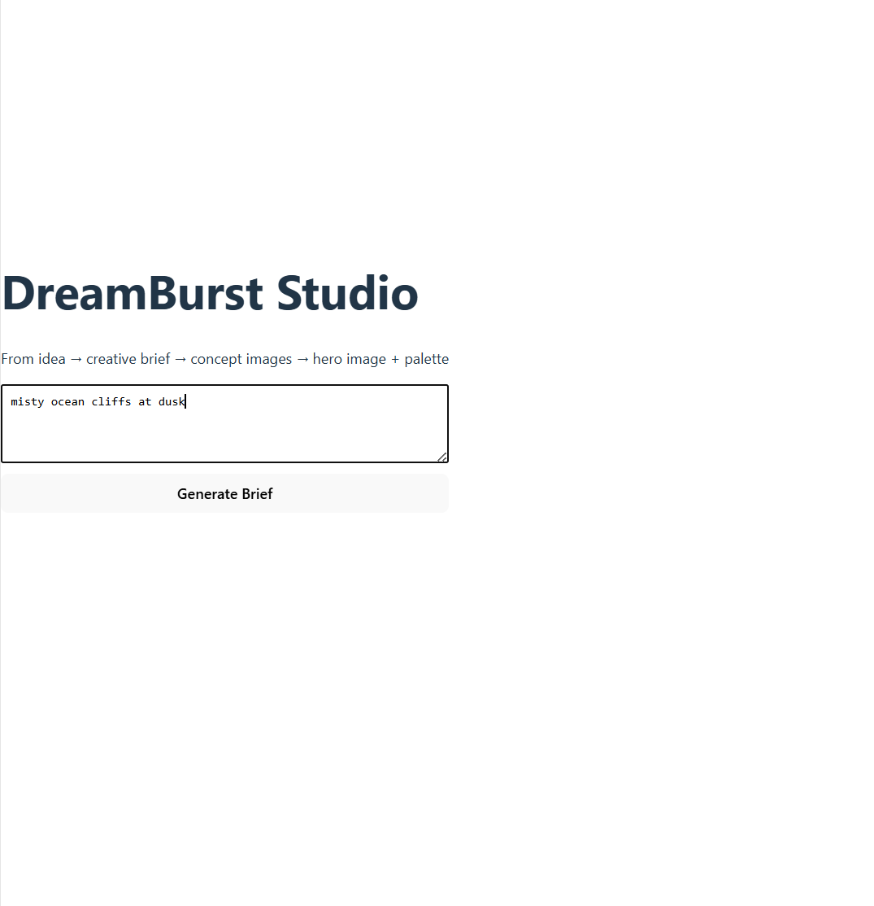
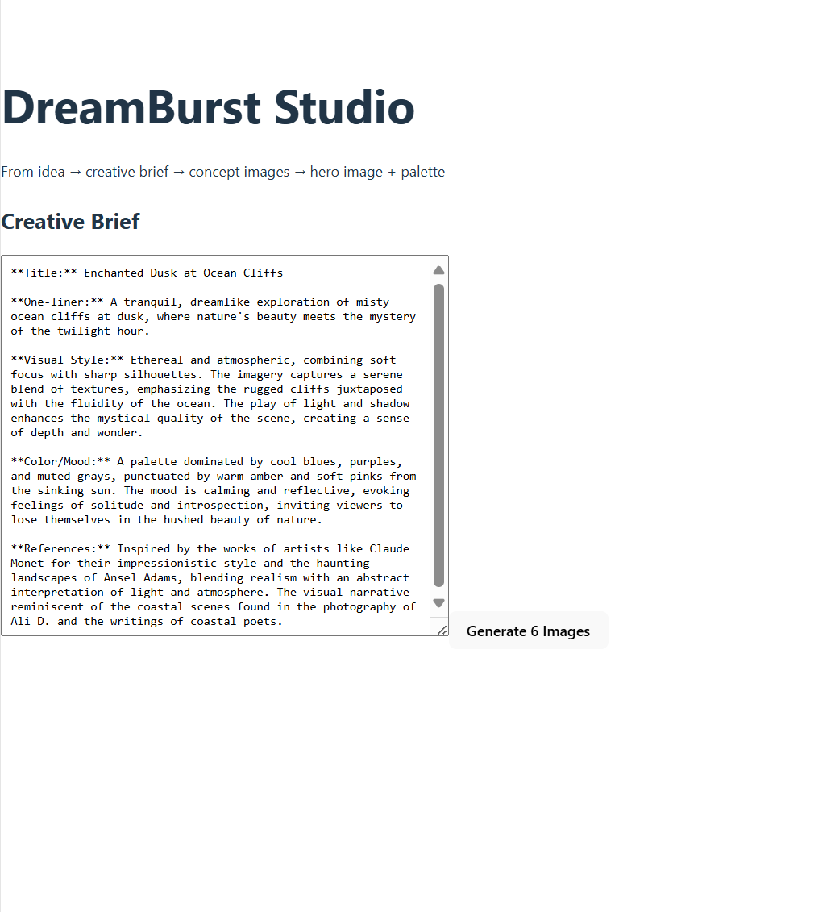
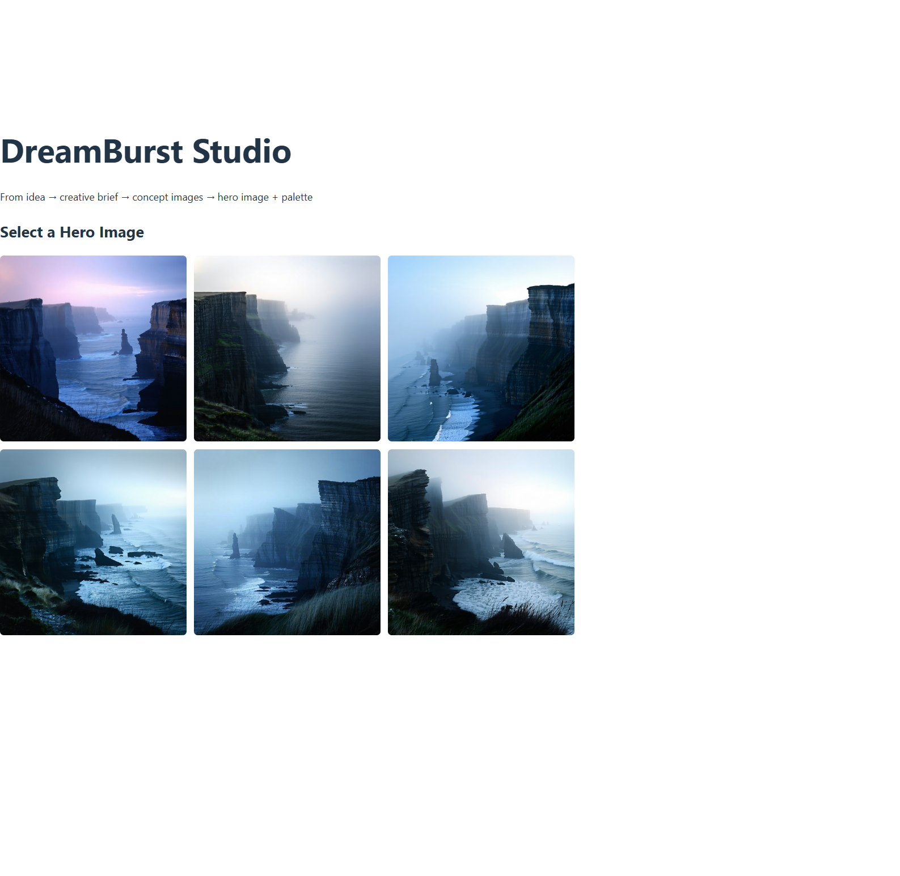

# DreamBurst (Prototype)

**Creative concept → Brief → Image batch → Palette & look metrics**

DreamBurst is an AI-powered creative ideation tool that uses the Model-Context-Protocol (MCP) to standardise communication between the app and the AI providers it relies on. This means you can easily swap providers with minimal code changes.

DreamBurst is designed for creatives in marketing, filmmaking, and story development. The user provides an initial theme, idea, or prompt. The system expands it into a full creative brief using the OpenAI API. This brief can be edited, refined, or used as inspiration for developing a campaign or storyline.

Once the brief is ready, it is sent to Stability AI, which generates a batch of six concept images representing the tone, themes, or core message. The user selects the strongest image, and DreamBurst extracts colour palette data and aesthetic metrics using scikit-image. These metrics can be used to create a cohesive visual identity across an entire campaign.

---

## App Demo (Screenshots)

### **1. Home → Idea Input**


---

### **2. AI-Generated Creative Brief**


OpenAI expands the user's idea into a structured brief including:
- Title  
- One-liner  
- Visual Style  
- Color/Mood  
- Artistic References  

---

### **3. Concept Image Batch (Stability AI)**


Users pick the strongest concept image to define the project’s visual identity.

---

### **4. Hero Image + Color Palette + Look Metrics**


DreamBurst performs:
- **5-color palette extraction**  
- **Role assignment:** primary, secondary, accent, neutralLight, neutralDark  
- **HEX copy buttons**  
- **Cinematography-style look metrics:**  
  - White balance (Kelvin, tint, mired shift)  
  - Tonal key (low/mid/high key)  
  - Dynamic range  
  - Contrast level  
  - Key-to-fill ratio  
  - Cool/Warm color percentages  

---

## Key Features

### **1. MCP-Driven AI Providers**  
DreamBurst uses the **Model-Context-Protocol (MCP)** to decouple the UI from AI providers.  
You can swap OpenAI or Stability AI with minimal code changes.

### **2. Creative Brief Generator**  
Transforms rough ideas into polished briefs ready for:
- concept art  
- campaigns  
- scripts  
- animations  
- worldbuilding  

### **3. Image Batch Generation**  
Requests a 6-image batch from Stability AI based on the creative brief.  
UI displays them in a responsive 3×2 grid.

### **4. Palette + Look Metrics**  
This is where DreamBurst becomes a *real* creative tool.  
It extracts:
- palette  
- tonal values  
- visual mood  
- look development metrics  
- contrast and DR  
- color temperature  


### **⚡ 5. Full-Stack Architecture**  
- **Frontend:** React (Vite)  
- **Backend:** FastAPI (Python)  
- **MCP Layer:** Node.js  
- **Image Processing:** scikit-image  
- **Deployment Ready:** Structure supports Netlify + EC2 hosting  

---

## Quickstart (Windows)

```powershell
git clone https://github.com/adrian-amoddio/dreamburst.git
cd dreamburst

# 1) Secrets
copy .env.example .env
# edit .env and paste your keys

# 2) Start backend
.\start_backend.ps1   # runs FastAPI on http://127.0.0.1:8080

# 3) Start MCP (new terminal)
cd .\mcp
$env:OPENAI_API_KEY = "sk-..."   # required for brief tool
.\start_mcp.ps1


---

##  Why I Built This

DreamBurst was created as a way to combine my interests in **software development**, **AI integration**, **creative tooling**, and **photography** into a single project.  

I wanted to build something that wasnt just a backend service or a UI mockup, but a **fully functional, end-to-end product** that demonstrates:

- real problem-solving  
- full-stack engineering  
- AI orchestration  
- colour science + image processing  
- UX design thinking  
- deployment-ready architecture  

The project replicates the workflow that real creative studios use when developing campaigns, visual directions, title sequences, film concepts, and brand identities but powered by AI.

---

## Architecture Overview

DreamBurst consists of three major components:

- **Frontend UI** — React + Vite  
- **Backend API** — FastAPI (Python)  
- **AI Provider Layer** — MCP (Node)  

### **System Diagram**

           ┌─────────────────────────┐
           │       React UI          │
           │  (User Input + Display) │
           └─────────────┬───────────┘
                         │ HTTP
                         ▼
           ┌─────────────────────────┐
           │      FastAPI Backend    │
           │  /brief  /images  /look │
           └─────────────┬───────────┘
                         │ MCP call
                         ▼
           ┌─────────────────────────┐
           │      MCP Server (Node)  │
           │  brief.js image.js etc. │
           └─────────────┬───────────┘
                   ┌──────┴─────────┐
                   ▼                ▼
        ┌────────────────┐   ┌──────────────────┐
        │     OpenAI     │   │   Stability AI    │
        │ (creative brief│   │ (image batches)   │
        └────────────────┘   └──────────────────┘
                    |
                     ▼
    ┌────────────────────────────────────┐
    │      scikit-image (Python)         │
    │ palette, tone, DR, key/fill, WB    │
    └────────────────────────────────────┘


## Notes for Hiring Managers

DreamBurst demonstrates how I approach building software:

- I take ideas from **concept** → **design** → **architecture** → **implementation** → **polish**.  
- I build systems that are **modular**, **extendable**, and **maintainable**.  
- I enjoy working with **AI**, **image processing**, **creative tools**, and **full-stack systems**.  
- I care about **clean UX**, **technical clarity**, and tools that solve real problems.  
- Every part of this project — MCP, FastAPI, React, scikit-image — was chosen to show end-to-end engineering ability, not just small isolated scripts.

If you'd like to discuss the this project or my experience with me, feel free to reach out.

---